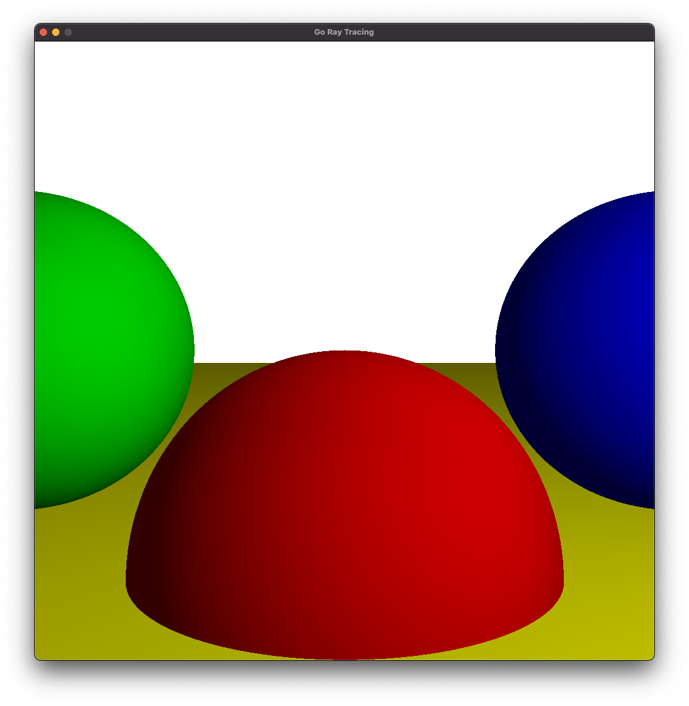

# go-graphics
Basic raytracing and rasterization in go + SDL (https://github.com/veandco/go-sdl2).

My notes as I work through [Computer Graphics from Scratch](https://gabrielgambetta.com/computer-graphics-from-scratch/)

`cd ray && SDL_RENDER_DRIVER=software go run .`

## Ray Tracing
</img>
</img>
</img>
</img>
</img>
</img>

## Rasterization
</img>
</img>

### Basic Concepts
* Canvas - a rectangular array of colored pixels.
* Coordinates 
  * Screen coordinates - origin is the top left
  * Canvas coordinates - origin is center
* Scene - the set of objects to render.
* Scene Coordinates
  * Y is up, X and Z are horizontal

# Ray Tracing

### Coordinate Conversion
* Camera Position = "O" = (0,0,0)
* Camera Orientation = Looks towards the positive Z-axis (with Y+ up and X+ to the right)
* Viewport = (Vw x Vh), Frontal to the camera (perpendicular to Z+ axis) and at distance d.

Since the viewport center matches the canvas center and the orientation is the same, in order to convert from canvas coords to viewport coords, we just need to scale:

Vx = Cx * (Vw/Cw)
Vy = Cy * (Vy/Cy)

Additionally, ever point on the viewport has distance "d", so z = "d" by defintion:

Vz = d

### Tracing Rays
In reality, light comes from a light source, but it's more efficient for us to do the tracing in reverse.
We'll consider a ray that originates at the camera, goes through a point in the viewport, and then hits an object in the scene.

### Equations
* Ray Equation -> P = O + t(V-O) (where t is any real number representing the distance along the ray)
  * Another way to express this is P = O +t*D (where D is the direction of the ray)

### Sphere Equation
* Based on "math", we can transform the equation for points on a sphere into a more useful form:
  * <P-C,P-C> = r^2 (Where the first part is the dot product of the vector from point to center)

### Combination
* We want to find P values that satisfy both equations (points that lie on the ray and on the sphere)
* We can combine both equations and simplify using trig to end up with:
  * t^2<D,D> + t(2<CO,D>) + <CO,CO> - r^2 = 0
  * This has the form of a quadratic equation, which has either 0, 1, or 2 solutions.
    * 0 solutions -> ray never hits the sphere.
    * 1 solution -> ray hits tangentially.
    * 2 solutions -> ray hits the sphere once on each side.
* Considering t
  * t < 0 represents points "behind the eye"
  * t = 1 represents points on the viewport
  * t > 1 represents points behind the viewpoint (these are the ones we care about)

### Lessons Learned
* The canvas and computer screen coordinate system conversion can be tricky. I initially used the following simple formulas:
    * Sx = Cw/2 + Cx
    * Sy = Cy/2 - Cy
* Mistake 1: I missed the subtraction sign in the second one. My scene rendered, but it was upside down.
* Mistake 2: I fixed the minus sign, then I hit an array out of bounds. You actually have to subtract 1.
* It's hard to visualize, but it actually makes sense. The loop I was using went from -Y to Y-1 (due to less than comparison).
* Once I flipped to subtraction, then I had a mismatch on my bounds and thus the overflow.

## Light
* Assumptions
  * All light is white (i => intensity of the light)
  * Ignore the atmosphere
* Types of Light Sources
  * Point Lights - defined by position and intensity
  * Directional Lights - defined by a direction and intensity
  * Ambient Light - defined by intensity
* Types of Objects
  * Matte -> Use diffuse reflection technique
  * Shiny -> Use specular reflection technique

* Basic approach
  * For each point, compute the amount of light from each light source and sum. Multiply this value by the color to get the final color.

### Diffuse Reflection
* Normal Vector - a unit vector perpendicular to the surface at a point. Call this normal N.
* Diffuse Reflection Equation (Complicated, but basically the sum of the following)
  * The intensity of the ambient light 
  * <N,L> / N x L for all directional and point lights

### Sphere Normals
* The Normal vector of any point of a sphere lies on a line that goes through the center of the sphere.
* Thus, N = (P-C) / |P-C| - we divide it by its own length so the result has a length of 1.

### Specular Reflection
* Use this approach for shiny objects.
* Shiny objects exhibit bright spots whose location depends on your point of view.
* The approach used here isn't based on physical reality. It's used because it looks good and is easy to compute.
* The heart of the equation is simply cos(x). However, we also use a "specular exponent" to control the shininess of the object.
* We can add specular reflection to our previous light equation making sure to only apply it when positive and with shiny objects.
* V is the vector from the point to the camera.

## Shadows and Reflections
* We need to take a more global view and consider other objects in the scene along with the light source. 
* For shadows: Basically we want to say "If there is an object between the point and the light source, don't illuminate the point with that light."
* For reflections: Basically we need to recursively trace a reflected ray (up to a certain depth) for any mirror surface.
* Rays of light are reflected symmetrically with respect to the surface normal.
* Reflectiveness isn't all or nothing, so we'll assign a number between 0 and 1 to every surface representing it's reflectiveness.
* We also have to make the background black so that all the colors don't get washed out due to the influence of white reflections.

## Camera Position and Rotation
* In order to support arbitrary camera positions and orientations, we have to make two simple changes.
* First, we simply pass in the camera position rather than (0,0,0) as the origin.
* Second, we multiply our existing direction vector by a matrix representing the camera's orientation.

## Problems!

When building my initial lighting, I ended up with a scene that was mostly correct but a bit too dark:

The problem ended up being a typo that prevented the ambient light from having any effect at all. After I fixed this, things matched the output from the book.

When building the specular reflection implementation, I ended up with a strange artifact: 

The problem is that the values were overflowing the color bytes and wrapping around to become dark. The fix is to clamp the resulted value to the max value of one byte (255).

# Rasterization

Rasterization favors performance over purity/accuracy. Rather than attempting to process every pixel in the viewport, rasterization processes each object in the scene. 

### Lines
Drawing a line is actually surprisingly difficult. Start with the basic formula y = a*x + b. This works for any line other than a strictly vertical one, so we'll ignore those for now.

We can use this to write a function that draws a line from one point to another.

To improve our line drawing, we can apply a general linear interpolation function to either x or y based on if the line is closer to horizontal or vertical.
